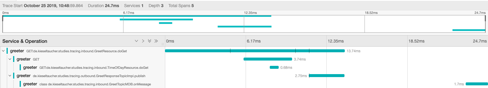
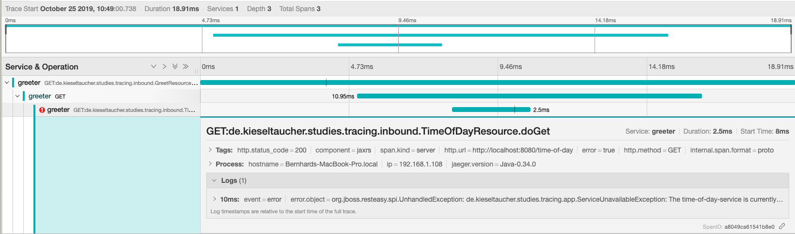
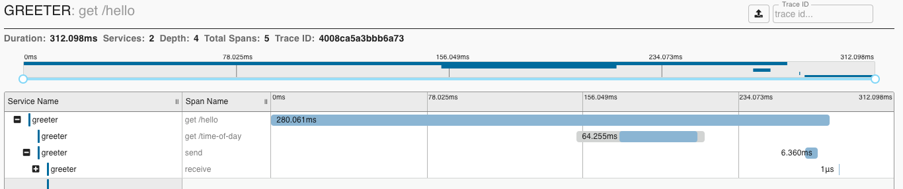
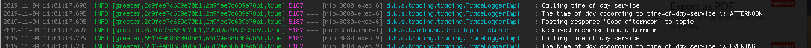

# Tracing einer Java-Servicelandschaft

*Mikroservices haben in den letzten Jahren einen Aufschwung verteilter Systeme eingeleitet.
Eine der Herausforderungen bei der Entwicklung eines verteilten Systems ist sicherzustellen,
dass es zu debuggen ist.*

Ein verteiltes System zu debuggen kann ganz schön mühsam sein.
Integrierte Systeme haben einen Stacktrace. Tritt ein Fehler auf, ist diese Aufrufhierarchie ein wichtiger Baustein, um die Fehlerursache einzugrenzen. In verteilten Systemen geht der Stacktrace aber zwischen den Systemaufrufen verloren.
Integrierte Systeme schreiben in ein Log. Der Threadname ist eine einfache Möglichkeit, die einzelnen Lognachrichten einer Arbeitseinheit zuzuordnen. Die Logs der Services in einer Systemlandschaft müssen dagegen erst einmal zusammengeführt werden. Und die Möglichkeit die einzelnen Logeinträge über die Systemgrenzen hinweg einer Arbeitseinheit zuzuordnen, muss erst einmal geschaffen werden

Letztlich sind Mikroservices verteilte Systeme, und die Entwicklung verteilter Systeme ist nicht leicht. Microservices wurden in den letzten Jahren romantisiert, und das hat diese Tatsache in den Hintergrund treten lassen.

Die Entwicklung muss also eine zusätzliche Anstrengung unternehmen, um die Vorgänge in ihrem System sichtbar zu machen. Tracing-Systeme wie [Jaeger](https://www.jaegertracing.io) oder [Zipkin](https://zipkin.io) können dabei unterstützen.

Hier macht eine Jaeger-Oberfläche sichtbar, dass die Greet-Resource zur Abarbeitung der Anfrage einen weiteren Dienst, die Time-Of-Day-Resource, abgefragt hat. Bevor sie die Anfrage beantwortet, publiziert sie noch eine Nachricht auf einem Topic. Erst in einem nachgelagerten Prozess wird die veröffentlichte Nachricht verarbeitet.

Im Fehlerfall ist in der Oberfläche nicht nur sichtbar, wo der Fehler entstanden ist, sondern auch welchen Geschäftsvorgang dieser Fehler beeinträchtigt hat:

Um solche Informationen zu erhalten, gibt es im wesentlichen drei Ansätze:
1. Einarbeitung des Tracings in den Produktivcode
2. Einsatz eines transparent im Produktionscode arbeitenden Tracing-Agenten
3. Anwendung des Sidecar-Patterns

Ich möchte diese Möglichkeiten abwägen. Dabei beschränke ich mich auf Microservices, die in einer Java-Systemlandschaft implementiert sind. Die Schnittstellen zwischen den Services nutzen REST für synchrone Aufrufe, und JMS (Java Messaging System) für asynchrone Prozesschritte.

#### Zielbild

Im Tracing der Beispielapplikation soll sichtbar werden, dass die Greet-Resource die Time-Of-Day-Resource aufruft. Dieser Aufruf soll in einem Eltern-Kind-Verhältnis stehen. Die Abfrage der Time-Of-Day-Resource ist ein Teil der Abarbeitung der Anfrage an die Greet-Resource (Elternprozess).

    |------------+-----/greet----------+----------|
      (child-of) |                     |  
                 |----/time-of-day-----|  

Eine Eltern-Kind-Beziehung bildet synchrone Aufrufe treffend ab. Für asynchrone Nachverarbeitungen passt eine Folgt-Aus-Beziehung besser. Die Verarbeitung der Nachricht auf dem Greet-Topic soll aus aus dem Aufruf der Greet-Resource folgen:

    |--+-----+-- /greet --+-------------+--|
       |     |            |             |    (follows-from)
         ...              |-- publish --|        >>>>>      |-- consume --|

## Einarbeitung des Tracings in den Produktivcode

In der Studie wird die [hier](app/) entworfene Applikation in zwei verschiedenen Technologiestacks einem Tracing unterworfen:
- Als JEE-Applikation im [Microprofile-Opentracing](https://github.com/eclipse/microprofile-opentracing/blob/master/spec/src/main/asciidoc/microprofile-opentracing.asciidoc)-konformen Applikationsserver [Thorntail](https://thorntail.io) und [Jaeger](https://www.jaegertracing.io) als Tracingsystem
- Als Spring-Boot-Applikation mit [Spring Cloud Sleuth](https://cloud.spring.io/spring-cloud-sleuth/reference/html/) und [Zipkin](https://zipkin.io)

##### Voraussetzungen

Um die Beispielanwendung laufen lassen zu können, benötigt man:
- Java 8
- [Maven 3](https://maven.apache.org)
- [Docker](https://www.docker.com)

### Microprofile-Opentracing

[Opentracing](https://opentracing.io) definiert einen Standard, wie Microservices für das Tracing instrumentiert werden können.  Um das im JEE-Stack umzusetzen, gibt es das [Microprofile-Opentracing](https://github.com/eclipse/microprofile-opentracing/blob/master/spec/src/main/asciidoc/microprofile-opentracing.asciidoc).

#### Wie wird das Tracing aktiviert?

Um das Microprofile in Thorntail zu aktivieren, müssen die folgenden Abhängigkeiten eingebunden werden. Hier der Ausschnitt aus dem [pom.xml](opentracing/pom.xml):

    <dependency>
      <groupId>io.thorntail</groupId>
      <artifactId>microprofile-opentracing</artifactId>
    </dependency>
    <dependency>
      <groupId>io.thorntail</groupId>
      <artifactId>jaeger</artifactId>
    </dependency>

In der [Konfiguration](opentracing/src/main/resources/project-defaults.yml) der Anwendung muss das Tracing mit Jaeger noch aktiviert werden:

    thorntail:  
      jaeger:  
        service-name: greeter  
        sampler-type: const  
        sampler-parameter: 1

Das Microprofile legt fest, dass JAX-RS-Applikationen von der Laufzeitumgebung instrumentiert werden müssen. Deswegen muss kein Code geschrieben werden, um sichtbar zu machen, dass die Time-Of-Day-Resource von der Greet-Resource genutzt wird. Ruft eine JAX-RS-Resource ein weitere Resource synchron auf, dann wird der Aufruf als Kind des Aufruferprozesses dargestellt.
Damit das aber funktioniert, muss ein spezieller JAX-RS-Client verwendet werden, wenn andere Microservices angefragt werden. Nur so ist sichergestellt, dass der aktuelle Kontext an den aufgerufenen Dienst übertragen wird. Im Beispiel erledigt das der  [TracingJaxRSClientProducer](opentracing/src/main/java/de/kieseltaucher/studies/tracing/tracing/TracingJaxRSClientProducer.java).

Das Microprofile macht allerdings keine Vorgaben, wie Aufrufe über JMS (Java Messaging Service) instrumentiert werden sollen. Es bietet aber eine [Registratur](https://opentracing.io/registry/), in der man nach ergänzenden Bibliotheken suchen kann. Dort finden sich beispielsweise Instrumentierungsbibliotheken für JDBC, oder eben auch [java-jms](https://opentracing.io/registry/java-jms/).
In dieser Studie habe ich mich trotzdem entschieden, die Instrumentierung selbst zu implementieren. Die Klasse [JMSContextMediator](opentracing/src/main/java/de/kieseltaucher/studies/tracing/tracing/JMSContextMediator.java) stellt diese Beziehung her. Sie kann den aktuellen Tracingkontext in eine zu sendende Nachricht einbetten. Auf der Empfängerseite stellt sie eine Folgt-Aus-Beziehung her.

#### Wie kann ich das ausprobieren?

Die Beispielanwendung im Modul opentracing läuft auf dem Applikationsserver Thorntail.
Sie wird folgendermaßen gestartet:

    mvn install
    cd opentracing
    mvn thorntail:run

Anschließend muss noch der Jaeger-Tracer zum Laufen gebracht werden:

    docker run -it --rm -p 6831:6831/udp -p 16686:16686 jaegertracing/all-in-one

Nun kann man die [Greet-Resource](http://localhost:8080/hello) abfragen und in der [Jaeger-UI](http://localhost:16686/search) nach Traces suchen:

### Spring Cloud - Sleuth

#### Wie wird das Tracing aktiviert?

[Spring Cloud Sleuth](https://cloud.spring.io/spring-cloud-sleuth/reference/html/) instrumentiert Aufrufe über JMS und REST von Haus aus (und noch sehr viel [mehr](https://cloud.spring.io/spring-cloud-sleuth/reference/html/#integrations)). Als Dreingabe reichert es das Logging mit der Tracing-ID an. Das erleichert es, die Traces mit den Logausgaben zu korrelieren.

Um das Tracing zu aktivieren, muss die Bibliothek spring-cloud-starter-zipkin in die Applikation eingebunden werden. Hier der Ausschnitt aus dem [pom.xml](sleuth/pom.xml):

    <dependency>  
      <groupId>org.springframework.cloud</groupId>  
      <artifactId>spring-cloud-starter-zipkin</artifactId>
    </dependency>

In der Standardeinstellung meldet Sleuth lediglich jeden zehnten Aufruf an das Tracing-Backend. Diese Stichproben sind sinnvoll, um etwa durchschnittliche Antwortzeiten zu ermitteln, ohne die Anwendung mit dem Tracing über die Gebühr zu belasten. Sie eignet sich aber nicht zum Debuggen. Um vollumfänglich zu protokollieren, kann dieser Wert in der [Applikationsskonfiguration](sleuth/src/main/resources/application.yml) überschrieben werden:

    sleuth.sampler.probability = 1

#### Wie kann ich das ausprobieren?

Die Beispielanwendung im Modul sleuth läuft mit Spring-Boot und wird folgendermaßen gestartet:

    mvn package
    cd sleuth
    mvn spring-boot:run

Der Tracer Zipkin steht als Docker-Image zur Verfügung:

    docker run -p 9411:9411 openzipkin/zipkin

Anschließen kann auf der [Zipkin_UI](http://localhost:9411) nach Traces der [Greet-Resource](http://localhost:8080/hello) gesucht werden:

Da Sleuth die IDs der Traces zum Mapped Diagnostic Context (MDC) von SLF4J hinzufügt, lassen sich die Traces leicht den Logausgaben der Applikation zuordnen:

